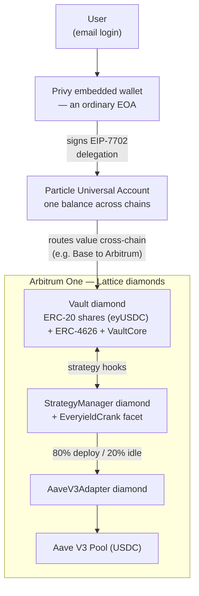

# Everyield

**The savings account that doesn't know what a chain is.**

Log in with an email, and your ordinary wallet becomes a smart account that treats every chain as one
balance. Tap **Save**, and your USDC lands in an ERC-4626 vault on Arbitrum One earning live Aave V3 yield —
even if the dollars started on a different chain. No bridges, no networks to pick, no gas token to hold.

Built for the **Encode UXMAXX Hackathon — Universal Accounts Track (Particle Network)**. The cross-chain leg
is handled entirely by the [Particle Universal Account SDK](https://developers.particle.network/) in
EIP-7702 mode; the on-chain savings vault is three EIP-2535 diamonds assembled from the
[**Lattice**](https://github.com/dadadave80/lattice) framework, consumed as an installable dependency.

---

## Try it

**Live app:** `<VERCEL_URL>`

**Run locally** — the frontend lives in [`app/`](app/):

```bash
cd app
bun install
bun dev            # http://localhost:3000
```

Set these five env vars (see [`app/.env.example`](app/.env.example)) — from the Particle and Privy dashboards:

| Variable | Source |
| --- | --- |
| `NEXT_PUBLIC_PARTICLE_PROJECT_ID` | dashboard.particle.network → project |
| `NEXT_PUBLIC_PARTICLE_CLIENT_KEY` | dashboard.particle.network → project |
| `NEXT_PUBLIC_PARTICLE_APP_ID` | dashboard.particle.network → Web app |
| `NEXT_PUBLIC_PRIVY_APP_ID` | dashboard.privy.io → app → Settings |
| `NEXT_PUBLIC_PRIVY_CLIENT_ID` | dashboard.privy.io → app → Settings |

The vault contracts are already live on Arbitrum One (below) — the app reads and writes them as-is.

---

## Deployed contracts — Arbitrum One (chain 42161)

All three diamonds are Etherscan-verified at deploy; a Sourcify layer is available via `make verify-mainnet`.
Addresses are the source of truth in [`deployments/42161.json`](deployments/42161.json).

| Contract | Address |
| --- | --- |
| Vault (`eyUSDC`) | [`0x4aE34A2fA9efD143C0330c306dDF8808eE34815D`](https://arbiscan.io/address/0x4aE34A2fA9efD143C0330c306dDF8808eE34815D) |
| StrategyManager | [`0xcFf692A6cc69D868Bb1944d9269a233c01643Adc`](https://arbiscan.io/address/0xcFf692A6cc69D868Bb1944d9269a233c01643Adc) |
| AaveV3Adapter | [`0x9e104F4Ec391128Ad0cc101D2D1bB5Be6c02Dd02`](https://arbiscan.io/address/0x9e104F4Ec391128Ad0cc101D2D1bB5Be6c02Dd02) |
| Deployer | [`0xdadada4e8038641212262fd94e816d4a57cdc751`](https://arbiscan.io/address/0xdadada4e8038641212262fd94e816d4a57cdc751) |

Deployed at block `485711716`; total deploy cost **0.000572 ETH** (38 txns). Underlying asset is Arbitrum
native USDC (`0xaf88d065e77c8cC2239327C5EDb3A432268e5831`) supplied into Aave V3.
A dress-rehearsal stack lives on Arbitrum Sepolia — [`deployments/421614.json`](deployments/421614.json).

---

## How it works



1. **Email in.** Privy issues an embedded wallet — a normal EOA. Under EIP-7702, that same key signs an
   authorization delegating the account, so the embedded wallet is both signer and executor of every vault call.
2. **One balance.** The Particle Universal Account (SDK v2.0.3, `useEIP7702: true`) aggregates the user's assets
   across chains into a single spendable number and quotes an all-in fee before any signature.
3. **One Save.** A deposit is a batched `approve` + ERC-4626 `deposit(assets, receiver)` on the Arbitrum vault.
   If the dollars are on another chain, Particle routes them there — **the contracts never bridge**.
4. **It earns.** An operator crank rebalances the vault to an 80% Aave / 20% idle split and supplies the idle
   adapter balance into Aave V3. Shares (`eyUSDC`) accrue live yield; withdrawals are partial or full.

---

## Built on Lattice

Everyield is also a demonstration of [**Lattice**](https://github.com/dadadave80/lattice) as a framework you
`forge install` and build on:

```bash
forge install dadadave80/lattice   # pinned at v0.2.0
```

Lattice's value is a **three-layer Diamond (EIP-2535) facet pattern** — facet → `*Lib` → interface. Everyield
assembles three diamonds straight from the framework's deploy recipes:

- **Vault** — the Lattice `VaultCore` recipe: ERC-20 share facet (`eyUSDC`), ERC-4626 facet, and the
  `VaultCore` strategy-hook facet, reused (selector surgery and all) rather than copied.
- **StrategyManager** — the stock `StrategyManager` diamond with **one extra facet cut in**: our
  [`EveryieldCrank`](src/EveryieldCrank.sol). It is a single external function (`crankDeploy`) that pushes the
  adapter's idle USDC into Aave — proof of how cheap it is to extend a Lattice diamond with app-specific logic.
- **AaveV3Adapter** — the framework's Aave V3 adapter, wired to the vault by
  [`EveryieldAaveInit`](src/EveryieldAaveInit.sol).

The assembly and wiring is one broadcast: [`script/DeployEveryield.s.sol`](script/DeployEveryield.s.sol).

---

## Live rehearsal — real funds, on-chain

A full round trip on **2026-07-20** with real money, verifiable against the vault address above:

- **$2.00 cross-chain deposit**, Base → Arbitrum, through the 7702 account. All-in fee **quoted $0.36, charged
  $0.36** — exactly as quoted.
- **Crank** produced the exact 80/20 split — **1,599,999 / 400,000** units (Aave / idle) on a 2,000,000-unit
  deposit.
- **Yield accrued**, then a **full recall** returned everything to idle with no principal loss.
- **$1.00 partial withdrawal** at exact share math, fee **$0.14**.

Every number is reproducible on-chain and pinned by the fork test below.

---

## What our fork test caught — in our own framework

Our Arbitrum-fork round trip caught a share-pricing composition bug in **Lattice's own `ERC4626Lib`**: its
`deposit`/`redeem` price against **idle-only** assets while funds are deployed to a strategy, because the
library binds to `totalAssets` internally and never sees the diamond's full-NAV `VaultCore` override. The fork
test pins the exact behavior — a partial redeem of 10% of shares pays 10% of the *idle buffer*, not 10% of NAV:

```solidity
// test/EveryieldFork.t.sol
assertApproxEqAbs(got, 2e6, 1, "partial redeem prices against idle-only totalAssets (20e6 * 10%)");
```

Rather than paper over it, the app **engineers around it, fail-closed**:

- **Interaction-window guard** — Save and Withdraw are enabled only when the vault is fully idle
  (`idleAssets >= totalAssets`); pre-first-read they stay disabled, never briefly open
  ([`app/lib/everyield.ts`](app/lib/everyield.ts), [`OptimizingNotice`](app/components/OptimizingNotice.tsx)).
- **Full-NAV display pricing** — positions are valued `shares × totalAssets / totalSupply`, **never**
  `convertToAssets`/`previewRedeem` (those bind to the idle-only path).

An upstream fix to `ERC4626Lib` is scoped for post-hackathon Lattice.

---

## Keeper & roadmap

The rebalance/deploy crank (`make crank`) and full recall (`make exit`) are **operator-side by design** for the
hackathon — one command, explicit keystore auth. Roadmap: hand these to **Chainlink Automation / Gelato**,
land the upstream `ERC4626Lib` fix, and support **multiple vaults / strategies**.

---

## Tests

| Suite | What it covers | Run |
| --- | --- | --- |
| Foundry — assembly | Three diamonds assemble and wire | `forge test` |
| Foundry — Arbitrum fork | Deposit → crank → earn → partial + full redeem, incl. the idle-only pricing pin | `forge test` (needs `ARBITRUM_RPC_URL`) |
| bun — calldata | `approve`+`deposit` batching, `redeem(shares, owner, owner)` encoding | `cd app && bun test` |
| bun — USD decoder | Hex/decimal fee decode, fail-closed to 0 on garbage | `cd app && bun test` |
| bun — feeDrifted | Re-confirm boundary: `max(20% of prev, $0.25)` | `cd app && bun test` |

Toolchain: Next.js 16.2.10 (Turbopack), React 19.2.7, bun, Particle Universal Account SDK 2.0.3, Privy;
Solidity 0.8.30 / Foundry.

## Budget

~**$2.10** total consumed of a $10 cap — deploy ~$1.50, Universal Account fees ~$0.50, keeper gas in cents.
